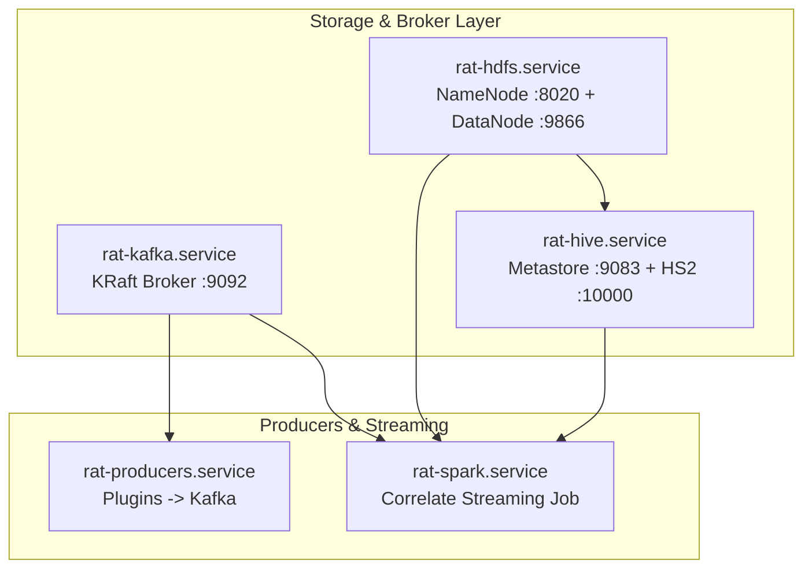
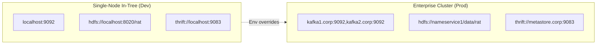

# Deployment Guide

This directory contains systemd user units, installation automation, and operational configuration for running the complete `rat` pipeline.

---

## 1. Architecture & Service Topology



### Port Mapping & Protocols

| Service | Port | Protocol | Role |
|---|---|---|---|
| `rat-kafka` | 9092 | Kafka PLAINTEXT | Event bus (`events.*`, `events.*.dlq`) |
| `rat-hdfs` | 8020 | Hadoop RPC | NameNode client RPC (defaultFS) |
| `rat-hdfs` | 9870 | HTTP | NameNode Web UI |
| `rat-hdfs` | 9866 | TCP | DataNode block transfer |
| `rat-hive` | 9083 | Thrift | Hive Metastore service |
| `rat-hive` | 10000 | Hive JDBC (Binary) | HiveServer2 SQL interface (beeline) |

---

## 2. Installation & Quickstart

### Automated Install

Run the installer from anywhere within the repository:

```bash
./deploy/install.sh --start
```

This will:
1. Detect your repository path and configure `~/.config/rat/env` with `RAT_ROOT`.
2. Copy user units to `~/.config/systemd/user/`.
3. Reload systemd (`systemctl --user daemon-reload`).
4. Enable and start all storage, producer, and Spark services.

### Manual Installation & Start Order

If you prefer manual control:

```bash
# 1. Ensure config directory and environment file exist
mkdir -p ~/.config/systemd/user ~/.config/rat
echo "RAT_ROOT=$PWD" >> ~/.config/rat/env

# 2. Copy units
cp deploy/systemd/user/*.service ~/.config/systemd/user/
systemctl --user daemon-reload

# 3. Start storage stack (broker, HDFS, Hive)
systemctl --user enable --now rat-kafka.service rat-hdfs.service rat-hive.service

# 4. Start producers and Correlate job
# (rat-producers automatically provisions plugin topics on startup via ExecStartPre)
systemctl --user enable --now rat-producers.service rat-spark.service
```

---

## 3. Configuration & Customization

### Environment File (`~/.config/rat/env`)

All units load `~/.config/rat/env` via `EnvironmentFile=-%h/.config/rat/env`:

```ini
# Path to cloned repository
RAT_ROOT=/home/username/rat

# Custom cursor database location (default: ~/.local/state/rat/cursors.db)
RAT_CURSOR_DB=/home/username/.local/state/rat/cursors.db

# Custom Kafka bootstrap broker (default: localhost:9092)
RAT_BOOTSTRAP=localhost:9092
```

### Systemd Drop-In Overrides

To customize individual services without editing tracked unit files, use systemd drop-ins:

```bash
mkdir -p ~/.config/systemd/user/rat-spark.service.d/
cat <<EOF > ~/.config/systemd/user/rat-spark.service.d/override.conf
[Service]
Environment="RAT_TRIGGER=10 seconds"
Environment="RAT_WATERMARK=15 minutes"
EOF
systemctl --user daemon-reload
systemctl --user restart rat-spark
```

---

## 4. Verification & Operations

### Service Health
```bash
systemctl --user status "rat-*"
```

### View Service Logs
```bash
journalctl --user -u rat-spark -f
journalctl --user -u rat-producers -f
```

### CLI Status Probe
```bash
uv run rat status
```
Shows broker connectivity, per-source cursor timestamps and ages, DLQ depths, and Parquet sink sizes.

### Query Hive Tables via Beeline
```bash
podman exec rat-hiveserver2 beeline -u jdbc:hive2://localhost:10000 -n hive \
  -e "SELECT entity, a_id, b_id, ts_ms FROM correlated ORDER BY dt DESC LIMIT 10;"

podman exec rat-hiveserver2 beeline -u jdbc:hive2://localhost:10000 -n hive \
  -e "SELECT event_id, source, ts_ms FROM rat_events LIMIT 10;"
```

---

## 5. Real Cluster Swap-In (Production Transition)

The in-tree Docker/Podman stack provides a zero-setup, self-contained single-node cluster. Moving from localhost containers to a real production Hadoop/Hive/Kafka cluster is **environment configuration only** — no application or Spark code changes are required.



### Environment Overrides for External Clusters

Set these variables in `~/.config/rat/env` or export them in your cluster scheduler:

| Variable | Dev / Local Value | Production Example | Description |
|---|---|---|---|
| `RAT_BOOTSTRAP` | `localhost:9092` | `kafka1.corp:9092,kafka2.corp:9092` | Production Kafka broker endpoints |
| `RAT_SINK_DIR` | `hdfs://localhost:8020/rat` | `hdfs://nameservice1/data/rat` | Production HDFS NameNode / HA URI |
| `RAT_CHECKPOINT_DIR`| `hdfs://localhost:8020/rat/checkpoints` | `hdfs://nameservice1/data/rat/checkpoints` | Checkpoint location for streaming queries |
| `RAT_HIVE_METASTORE_URI` | `thrift://localhost:9083` | `thrift://hive-meta1.corp:9083` | Enterprise Hive Metastore Thrift endpoints |
| `RAT_HIVE_BASE` | `hdfs://localhost:8020/rat` | `hdfs://nameservice1/data/rat` | Base URI for external table locations |
| `RAT_HIVE_ENABLED` | `true` | `true` | Enables Hive catalog registration & MSCK |
| `RAT_TRIGGER` | `30 seconds` | `1 minute` | Micro-batch trigger interval |
| `RAT_WATERMARK` | `10 minutes` | `30 minutes` | Watermark duration for event-time join |
| `RAT_MASTER` | `local[*]` | `yarn` or `k8s://...` | Spark execution backend |

### Deploying Spark Correlate on YARN or Kubernetes

For large-scale production, submit the compiled fat JAR to your cluster manager using `spark-submit`:

```bash
# Package the Spark application
cd spark && sbt package

# Submit to YARN cluster
spark-submit \
  --class rat.Correlate \
  --master yarn \
  --deploy-mode cluster \
  --num-executors 10 \
  --executor-cores 4 \
  --executor-memory 8G \
  --driver-memory 4G \
  --conf spark.hadoop.hive.metastore.uris=thrift://hive-meta1.corp:9083 \
  --conf spark.sql.warehouse.dir=hdfs://nameservice1/apps/hive/warehouse \
  spark/target/scala-2.13/rat-spark_2.13-0.1.0.jar
```

### Kerberos & Security Considerations

When swapping to a secured Kerberized cluster:
1. **HDFS / YARN Authentication**:
   ```bash
   kinit -kt /etc/security/keytabs/rat.keytab rat@CORP.INTERNAL
   export HADOOP_CONF_DIR=/etc/hadoop/conf
   ```
2. **Kafka SASL / SSL**:
   Pass JAAS authentication flags via `RAT_PRODUCER_CONFIG` or `spark.driver.extraJavaOptions`:
   ```text
   -Djava.security.auth.login.config=/path/to/kafka_jaas.conf
   ```
3. **External Hive Tables**:
   Ensure the `rat` service account has read/write POSIX or HDFS ACL permissions on `/data/rat/correlated` and `/data/rat/events_raw`.
