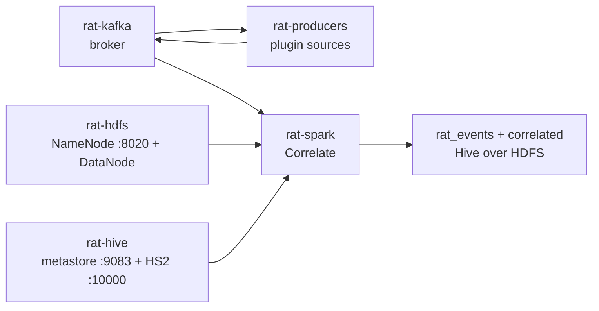

# Ops

Running the pipe as a system on one machine: broker, HDFS, Hive, producers,
job, query. Dependencies come from the flake — every command assumes the
[nix develop](setup.md) shell (or the unit wrappers that do the same).

## Start order



Quickest start with systemd user units:
```bash
./deploy/install.sh --start
```
Or manually step-by-step:
1. `./deploy/install.sh` (installs units and writes `~/.config/rat/env` with `RAT_ROOT`)
2. `systemctl --user enable --now rat-kafka.service rat-hdfs.service rat-hive.service`
3. `systemctl --user enable --now rat-producers.service rat-spark.service` (producers unit automatically provisions topics via `ExecStartPre`)

Full deployment runbook, drop-ins, and production cluster swap-in: [deploy/README.md](../deploy/README.md).

Not on NixOS / prefer by hand:

```bash
podman-compose -f infra/kafka/compose.yml up -d
podman-compose -f infra/hadoop/compose.yml up -d
podman-compose -f infra/hive/compose.yml up -d     # after HDFS is up
./scripts/make-topics.sh
nix develop -c uv run rat run
cd spark && RAT_HIVE_ENABLED=true RAT_HIVE_METASTORE_URI=thrift://localhost:9083 \
  RAT_SINK_DIR=hdfs://localhost:8020/rat \
  RAT_CHECKPOINT_DIR=hdfs://localhost:8020/rat/checkpoints \
  nix develop -c sbt -batch run
```

Without units, keep those in terminals or tmux; `rat run` stops cleanly on
SIGTERM/SIGINT (cursor is already durable, producer flushes on exit).

## Query

Through HiveServer2 — the read surface for humans:

```bash
podman exec rat-hiveserver2 beeline -u jdbc:hive2://localhost:10000 -n hive \
  -e "SELECT entity, a_id, b_id, ts_ms FROM correlated ORDER BY dt DESC"
podman exec rat-hiveserver2 beeline -u jdbc:hive2://localhost:10000 -n hive \
  -e "SELECT event_id, source, ts_ms FROM rat_events WHERE source='hn' LIMIT 10"
```

Tables live in the `default` database (`correlated`, `rat_events`). Plain
filters and `LIMIT`s run as fetch tasks; heavy `ORDER BY`s need a real
execution engine (Tez/MR) which the single-node image does not provide —
do analytics through Spark:

```bash
cd spark && RAT_HIVE_ENABLED=true RAT_HIVE_METASTORE_URI=thrift://localhost:9083 \
  RAT_SINK_DIR=hdfs://localhost:8020/rat nix develop -c sbt -batch "runMain rat.Query"
```

## Verify any time

- `uv run rat status` — broker up, cursor age per source, DLQ depth, sink sizes.
- `uv run rat dash` — the same, live in a browser at `127.0.0.1:8765`, plus the event stream, correlated pairs and stored rows with filter, sort and group ([GETSTARTED](../GETSTARTED.md#6-watch-it-in-the-dashboard-terminal-3)).
- `uv run rat dlq [--topic T] [--n N]` — what landed in the DLQ and why.
- `podman exec rat-hiveserver2 beeline -u jdbc:hive2://localhost:10000 -n hive -e "SELECT ..."`
- `podman exec rat-namenode hdfs dfs -ls /rat/correlated` — partitions on HDFS.
- `./scripts/smoke.sh` — full fixture-driven end-to-end run against the local
  (dev) profile; exits non-zero if the pair is not exactly one row.
- `./scripts/smoke-hive.sh` — live end-to-end smoke test against real HDFS + HiveServer2 + beeline.

## Where state lives

| Path | What |
|---|---|
| podman volume `kafka-data` | broker log segments |
| podman volume `rat_hdfs-namenode` | NameNode fsimage/edits (formatted on first boot only) |
| podman volume `rat_hdfs-datanode` | HDFS block storage — **wipe both together** or blocks go missing |
| metastore Derby (container layer) | table definitions only — rebuilt by the job/`rat.Query` on start, by design |
| `$RAT_CURSOR_DB` (`~/.local/state/rat/cursors.db` under the unit) | per-source cursors |
| `hdfs://localhost:8020/rat` | `correlated/` + `events_raw/` Parquet + `checkpoints/` |
| `$RAT_DLQ_SPOOL` (`~/.local/state/rat/dlq-spool/`) | rows that failed even the DLQ write |

The metastore schema is intentionally ephemeral: tables are EXTERNAL, the
files are the source of truth, and `rat.Hive` re-creates the definitions at
startup. Wiping the metastore loses nothing.

Deleting a sink tree orphans its checkpoint: drop both together
(`/rat/correlated` + `/rat/checkpoints/correlate-v2`), or the job replays into
stale offsets. The correlate checkpoint is versioned — `correlate-v2` since
the join stopped hardcoding hn vs rss and now pairs any sources on entity +
time: wipe or ignore old `checkpoints/correlate` state after upgrading, and
never point `correlate-v2` at an existing `correlated` sink without resetting
both. Deleting the **datanode volume alone** loses every block the
namenode still references — wipe `rat_hdfs-namenode` + `rat_hdfs-datanode`
as a pair.

## Local (dev) profile

The smoke script and default `RAT_SINK_DIR` point at local files
(`/tmp/rat-smoke`, `/tmp/rat`) — same clauses, `file://` instead of
`hdfs://`, Hive layer off. CI runs the smoke this way. Nothing in the job
changes between profiles: paths that carry a scheme are used as-is.

## DLQ

A message reaches `events.<source>.dlq` when emit exhausts its retry budget
or the payload fails the plugin schema. `rat dlq` shows the count and the
`rat.error` reason. Rows that fail even the DLQ write spool to
`$RAT_DLQ_SPOOL` as JSON lines — re-emit them with
`uv run python scripts/fixture.py`-style code or replay by hand once the
broker is healthy, then clear the spool file.

## Freshness contract

The job repairs both Hive tables (`MSCK REPAIR TABLE`) as micro-batches
land, throttled to one repair per `RAT_HIVE_MSCK_MIN_SECONDS` (30s default),
so a query never sees a missing partition while the job runs. If you ever
write Parquet outside the job, run `MSCK REPAIR TABLE rat_events; MSCK
REPAIR TABLE correlated;` yourself ([hive/rat_events.sql](../hive/rat_events.sql)).

## Cluster swap-in

The in-tree stack is a single-node cluster. Moving to real hardware is env
only: `RAT_SINK_DIR` / `RAT_CHECKPOINT_DIR` / `RAT_HIVE_BASE` at the real
NameNode (`hdfs://realnn:8020/rat`), `RAT_HIVE_METASTORE_URI` at the real
metastore. No code changes — the same clauses the course and docs promised.

## Retention

Topics: 7 days for `events.*`, 30 days for DLQs (`scripts/make-topics.sh`
config). Parquet sinks grow forever by design — archiving is a later,
separate job over the same files.
