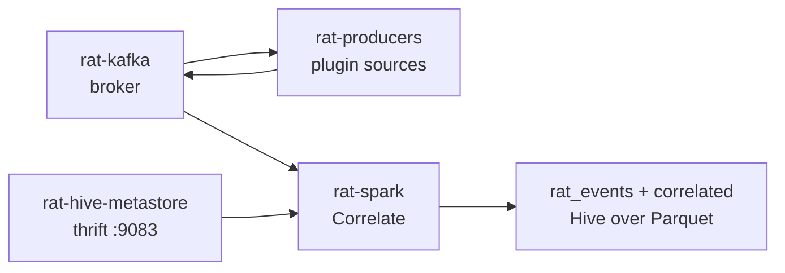

# Ops

Running the pipe as a system on one machine: broker, metastore, producers,
job, query. Dependencies come from the flake — every command assumes the
[nix develop](setup.md) shell (or the unit wrappers that do the same).

## Start order



1. `systemctl --user enable --now rat-kafka.service rat-hive-metastore.service`
2. `./scripts/make-topics.sh` (also runs as `ExecStartPre` of the producers unit)
3. `systemctl --user enable --now rat-producers.service rat-spark.service`

Not on NixOS / prefer by hand:

```bash
podman-compose -f infra/kafka/compose.yml up -d
podman-compose -f infra/hive-metastore/compose.yml up -d
./scripts/make-topics.sh
nix develop -c uv run rat run
cd spark && RAT_HIVE_ENABLED=true RAT_HIVE_METASTORE_URI=thrift://localhost:9083 \
  nix develop -c sbt -batch run
```

Without units, keep those in terminals or tmux; `rat run` stops cleanly on
SIGTERM/SIGINT (cursor is already durable, producer flushes on exit).

## Verify any time

- `uv run rat status` — broker up, cursor age per source, DLQ depth, sink sizes.
- `uv run rat dlq [--topic T] [--n N]` — what landed in the DLQ and why.
- `cd spark && nix develop -c sbt -batch "runMain rat.Query"` — latest raw
  envelopes + latest correlated pairs.
- `./scripts/smoke.sh` — full fixture-driven end-to-end run; exits non-zero
  if the pair is not exactly one row. Uses its own sink under `/tmp` and
  refuses to wipe a custom durable `RAT_SINK_DIR`.

## Where state lives

| Path | What |
|---|---|
| podman volume `kafka-data` | broker log segments |
| podman volume `hive-metastore-data` | metastore Derby db |
| `$RAT_CURSOR_DB` (`~/.local/state/rat/cursors.db` under the unit) | per-source cursors |
| `$RAT_SINK_DIR` (`/tmp/rat` default) | `correlated/` + `events_raw/` Parquet + `checkpoints/` |
| `$RAT_DLQ_SPOOL` (`~/.local/state/rat/dlq-spool/`) | rows that failed even the DLQ write |

Deleting a sink dir orphans its checkpoint: drop both together
(`correlated/` + `checkpoints/correlate`), or the job replays into stale
offsets. `/tmp/rat` is scratch — set `RAT_SINK_DIR` to something durable
(`RAT_SINK_DIR=$HOME/rat-sinks`) before pointing Hive at it seriously.

## DLQ

A message reaches `events.<source>.dlq` when emit exhausts its retry budget
or the payload fails the plugin schema. `rat dlq` shows the count and the
`rat.error` reason. Rows that fail even the DLQ write spool to
`$RAT_DLQ_SPOOL` as JSON lines — re-emit them with
`uv run python scripts/fixture.py`-style code or replay by hand once the
broker is healthy, then clear the spool file.

## Freshness contract

The job repairs both Hive tables (`MSCK REPAIR TABLE`) as micro-batches
land, throttled to one repair per `RAT_HIVE_MSCK_MIN_SECONDS` (30s default),
so a query never sees a missing partition while the job runs. If you ever
write Parquet outside the job, run `MSCK REPAIR TABLE rat_events; MSCK
REPAIR TABLE correlated;` yourself ([hive/rat_events.sql](../hive/rat_events.sql)).

## Cluster swap-in

Everything is env: `RAT_SINK_DIR=hdfs://nn/rat` (+ matching
`RAT_CHECKPOINT_DIR`), `RAT_HIVE_BASE=hdfs://nn/rat` for the table
locations, `RAT_HIVE_METASTORE_URI` at the cluster metastore. No code
changes — the same clauses the course and docs promised.

## Retention

Topics: 7 days for `events.*`, 30 days for DLQs (`scripts/make-topics.sh`
config). Parquet sinks grow forever by design — archiving is a later,
separate job over the same files.
