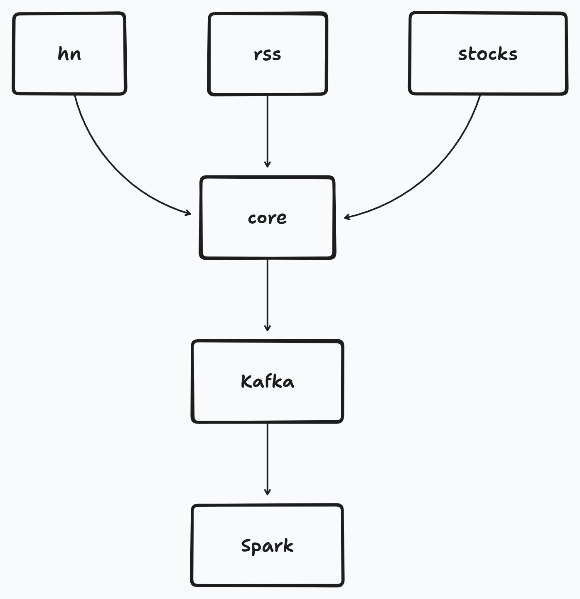
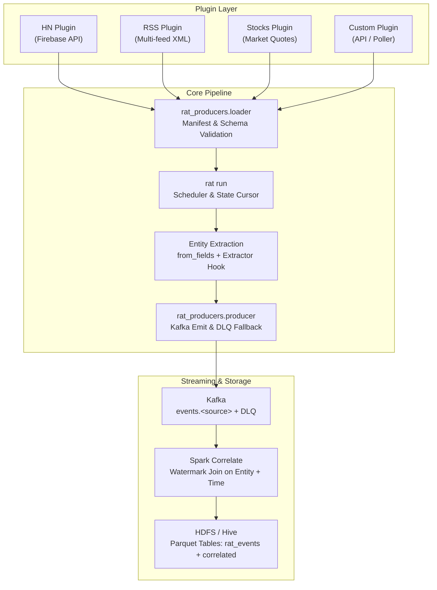

# Plugin System



Source: [rat-plugins.tldraw](rat-plugins.tldraw).

Core does not know HN, RSS, stocks, news, or Lobsters. A plugin is a directory containing a manifest (`plugin.toml`), payload schema (`schema.json`), and poller adapter (`adapter.py`). Drop it into a plugin root, run `./scripts/make-topics.sh` to provision its Kafka topics, and the source is live.

Spark reads the envelope only. If adding a source requires editing Scala code or rebuilding the Spark job, the architectural boundary failed.

---

## 1. Core vs. Plugin Architecture



### Responsibility Matrix

| Feature | Plugin | Core |
|---|---|---|
| **Data Fetching** | Polling API, HTTP, XML/JSON parsing | Scheduling intervals, timeout handling |
| **Payload Structure** | Defines `schema.json` | Validates payload against JSON schema |
| **Entity Extraction** | Specifies `from_fields` + custom extractor | Applies extractor, dedupes & normalizes keys |
| **Transport** | Yields envelope dicts with payload | Serializes, emits to Kafka, manages retries |
| **State** | Yields events with monotonic `ts_ms` | Persists cursors to SQLite (`rat-cursors.db`) |
| **Failure Handling** | Catches per-item/feed errors gracefully | Routes invalid/undeliverable rows to DLQ / spool |
| **Join Logic** | Unaware of other plugins | Joins any sources sharing entity + time window |

---

## 2. Directory Layout & Discovery

A plugin is packaged as a directory:

```text
plugins/<name>/
  plugin.toml     # Manifest (required): name, topic, interval, schema, fields
  schema.json     # Payload JSON Schema (required): validates payload dict
  adapter.py      # Adapter implementation (required): register() and poll()
  extract.py      # Optional module for custom entity extraction logic
```

### Discovery Roots & Precedence

Core loads plugins across multiple tiers. If the same plugin `name` is discovered in multiple locations, the **later root wins** (allowing user-level configuration to override repo defaults):

1. **Configured Environment Directory**: `$RAT_PLUGINS_DIR` or `$RAT_ROOT/plugins` (if set)
2. **In-Tree Repo Directory**: `<repo_root>/plugins/`
3. **Current Working Directory**: `./plugins/` (if different from repo root)
4. **System-Wide Directory**: `/var/lib/rat/plugins/`
5. **User Configuration Directory**: `~/.config/rat/plugins/`

Inspect all active plugins at any time:

```bash
uv run rat plugins
```

Output:
```text
hn  events.hn  60s
lobsters  events.lobsters  5m
news  events.news  2m
rss  events.rss  5m
stocks  events.stocks  60s
```

---

## 3. Plugin File Specifications

### 3.1. `plugin.toml` (Manifest)

Every plugin must define `plugin.toml`:

```toml
name = "stocks"
topic = "events.stocks"
interval = "60s"

# Optional plugin-specific configuration defaults
[config]
symbols = ["AAPL", "MSFT", "GOOGL"]

[payload]
schema = "schema.json"

[entities]
from_fields = ["symbol"]
```

#### Manifest Fields

- `name` *(string, required)*: Unique source identifier (e.g. `hn`, `rss`, `stocks`). Must match `^[a-z0-9_-]+$`.
- `topic` *(string, required)*: Target Kafka topic. Must match `^events\.[a-z0-9_-]+$`.
- `interval` *(string, required)*: Polling period. Format `<number>[smh]`, e.g., `30s`, `5m`, `1h`.
- `[payload].schema` *(string, required)*: Relative path to JSON schema file (typically `"schema.json"`).
- `[entities].from_fields` *(list of strings, optional)*: Payload field names whose values are concatenated and fed into the extractor.
- `[config]` *(table, optional)*: Arbitrary key-value config consumed by the adapter (e.g., URLs, symbols, API thresholds).

---

### 3.2. `schema.json` (Payload Schema)

Payload validation uses [JSON Schema](https://json-schema.org/) (Draft 7 or Draft 2020-12).

Example (`plugins/stocks/schema.json`):

```json
{
  "$schema": "https://json-schema.org/draft/2020-12/schema",
  "type": "object",
  "required": ["symbol", "price"],
  "properties": {
    "symbol": { "type": "string" },
    "price": { "type": "number" },
    "currency": { "type": "string" },
    "change": { "type": "number" },
    "volume": { "type": "integer" }
  },
  "additionalProperties": true
}
```

> [!IMPORTANT]
> If an emitted envelope's `payload` fails schema validation, the message is **never published to the main topic**. Instead, core routes it directly to `events.<source>.dlq` with a `rat.error` header detailing the violation, protecting downstream Spark jobs from poisoned rows.

---

### 3.3. `adapter.py` (Source Implementation)

`adapter.py` must define a `register(app)` function and a `poll(since_ms=None)` function.

```python
import urllib.request
import json
from rat_producers.extract import extract_entities

def register(app):
    """Entry point called by rat_producers.loader on startup."""
    app.add_source("my_source", poll=poll)
    app.add_extractor("my_source", extract_entities)

def poll(since_ms=None) -> list[dict]:
    """Poll external source and return list of raw envelope dicts."""
    envelopes = []
    # Fetch external data...
    return envelopes
```

#### Envelope Contract

`poll()` returns a list of dictionaries adhering to the Rat Envelope:

```python
{
    "event_id": "stocks:AAPL:1725192000000",  # Unique string (source-prefixed recommended)
    "source": "stocks",                       # Matches manifest name
    "entities": [],                           # Core will populate from from_fields
    "ts_ms": 1725192000000,                   # Milliseconds epoch (int)
    "payload": {                              # Dictionary matching schema.json
        "symbol": "AAPL",
        "price": 250.5,
        "currency": "USD"
    }
}
```

- **`entities`**: `poll()` can return `entities: []`. Core always runs the registered extractor over `[entities].from_fields`, overwriting `entities`.
- **`ts_ms`**: Monotonic event time in milliseconds. When `since_ms` is provided, items with `ts_ms <= since_ms` should be skipped to prevent duplicates.
- **`event_id`**: Deterministic identifier used for deduplication, partitioning, and lineage tracking.

---

### 3.4. Entity Extraction Hook

Spark correlates streams across sources by joining on `entity` within a time watermark.

1. **Default Cashtag Extractor**: Core provides `rat_producers.extract.extract_entities`, which extracts uppercase tickers prefixed by `$` (e.g., `"$AAPL" -> "AAPL"`).
2. **Custom Extractor**: If a source contains symbols without `$` (like `symbol = "AAPL"` in stocks), register a custom extractor via `app.add_extractor(name, fn)`:

```python
import re

def extract_stocks(text: str) -> list[str]:
    # Extract ticker tokens matching 1-5 letters
    return [t.upper() for t in text.split() if re.match(r"^[A-Z]{1,5}$", t)]

def register(app):
    app.add_source("stocks", poll=poll)
    app.add_extractor("stocks", extract_stocks)
```

Core normalizes all extracted entities:
- Trims whitespace
- Deduplicates keys preserving order
- Drops empty strings

If no entities are found, `entities` is `[]`. The event still lands in `rat_events` (raw Parquet table), but skips the `correlated` join.

---

## 4. User Configuration Overrides

Plugins can be configured without editing source files. Core plugins check `~/.config/rat/<plugin_name>.toml` for user-defined configuration:

### RSS Multi-Feed Override (`~/.config/rat/rss.toml`)

```toml
[config]
urls = [
    "https://hnrss.org/frontpage",
    "https://feeds.arstechnica.com/arstechnica/index",
    "https://techcrunch.com/feed/"
]
```

### Stocks Watchlist Override (`~/.config/rat/stocks.toml`)

```toml
[config]
symbols = ["AAPL", "MSFT", "GOOGL", "NVDA", "TSLA"]
```

### News Watchlist Override (`~/.config/rat/news.toml`)

`news` pulls Yahoo Finance headlines per symbol and tags each headline with that symbol, so it pairs with `stocks` quotes for the same ticker. Keep both watchlists in step:

```toml
[config]
symbols = ["AAPL", "MSFT", "GOOGL", "NVDA", "TSLA"]
```

The adapter merges user overrides over defaults in `plugin.toml`.

---

## 5. Step-by-Step Tutorial: Creating a New Plugin

Here is how to create a `crypto` price source in under 5 minutes:

### Step 1: Create plugin directory
```bash
mkdir -p plugins/crypto
```

### Step 2: Write `plugins/crypto/plugin.toml`
```toml
name = "crypto"
topic = "events.crypto"
interval = "30s"

[config]
coins = ["bitcoin", "ethereum", "solana"]

[payload]
schema = "schema.json"

[entities]
from_fields = ["symbol"]
```

### Step 3: Write `plugins/crypto/schema.json`
```json
{
  "$schema": "https://json-schema.org/draft/2020-12/schema",
  "type": "object",
  "required": ["symbol", "price_usd"],
  "properties": {
    "symbol": { "type": "string" },
    "price_usd": { "type": "number" }
  },
  "additionalProperties": true
}
```

### Step 4: Write `plugins/crypto/adapter.py`
```python
import json
import time
import urllib.request
from rat_producers.extract import extract_entities

COIN_MAP = {"bitcoin": "BTC", "ethereum": "ETH", "solana": "SOL"}

def register(app):
    app.add_source("crypto", poll=poll)
    app.add_extractor("crypto", extract_entities)

def poll(since_ms=None):
    url = "https://api.coingecko.com/api/v3/simple/price?ids=bitcoin,ethereum,solana&vs_currencies=usd"
    req = urllib.request.Request(url, headers={"User-Agent": "rat-agent/1.0"})
    with urllib.request.urlopen(req, timeout=10) as r:
        data = json.load(r)
    
    ts_ms = int(time.time() * 1000)
    envelopes = []
    for coin_id, symbol in COIN_MAP.items():
        if coin_id in data:
            price = data[coin_id]["usd"]
            envelopes.append({
                "event_id": f"crypto:{symbol}:{ts_ms}",
                "source": "crypto",
                "entities": [],
                "ts_ms": ts_ms,
                "payload": {"symbol": symbol, "price_usd": float(price)},
            })
    return envelopes
```

### Step 5: Provision Topics
Run the idempotent topic creator:
```bash
./scripts/make-topics.sh
```
This automatically parses `plugins/crypto/plugin.toml` and creates `events.crypto` and `events.crypto.dlq` in Kafka.

### Step 6: Test Single Poll
```bash
uv run rat run --once
uv run rat status
```

---

## 6. Testing Plugins

Plugins are unit-tested with `pytest` using mocked HTTP responses to ensure tests run offline without external network dependencies.

Example test (`producers/tests/test_crypto_adapter.py`):

```python
from unittest.mock import patch
import io
import json
from plugins.crypto import adapter

SAMPLE = {"bitcoin": {"usd": 65000.0}}

def fake_urlopen(req, timeout=None):
    return io.BytesIO(json.dumps(SAMPLE).encode())

def test_crypto_poll():
    with patch("urllib.request.urlopen", fake_urlopen):
        envs = adapter.poll()
    assert len(envs) >= 1
    assert envs[0]["source"] == "crypto"
    assert envs[0]["payload"]["symbol"] == "BTC"
```

Run test suite:
```bash
uv run pytest producers/tests/
```
